# Pythonの環境構築

Dockerを使えば、Anacondaのコンテナをすぐに利用可能で、
そこに含まれるJupyterNotebookを使うことでPythonの実行が可能です。
Dockerで構築する場合は、以下を参照してください。
https://github.com/adya2523/docker-anaconda
ただし、Ssleniumなどブラウザを起動して動かすプログラムを利用することもあるので，  
以下の手順でローカルに構築しておくことをお勧めします。

# Pythonのインストール
以下のサイトより、「Download Python ~」をクリックしてPythonをダウンロードします。
https://www.python.org/downloads/
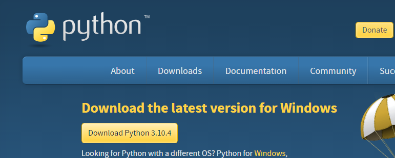

インストーラを起動して、  
「Add Python ~ ro PATH」をチェックしてから「Install Now」を選択してください。
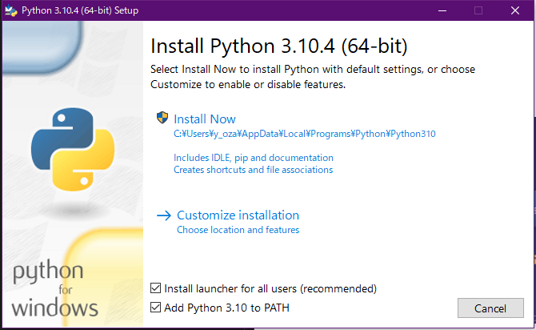


完了したら、コマンドプロンプトで`python`を入力して、バージョンが表示されれば利用可能になっています。
```
$ python
Python 3.9.7 (tags/v3.9.7:1016ef3, Aug 30 2021, 20:19:38) [MSC v.1929 64 bit (AMD64)] on win32
Type "help", "copyright", "credits" or "license" for more information.
```

## 社内利用の場合
ライブラリをインストールする際に、プロキシに阻まれます。
以下の設定が必要になります。

以下のフォルダ構造でpip.iniを作成します。
`C:\Users\【ユーザ】\AppData\Roaming\pip\pip.ini`

pip.iniに以下の内容を書き込んで保存します。
（〇〇〇〇は会社名に置き換えてください。）
```
[global]
proxy = 社員番号:COMPASSパスワード@proxy1.〇〇〇〇info.jp:8089
```

# Visual Studio Codeのインストール
ソフトウエア開発のデファクトスタンダードであるコードエディタのVisual Studio Codeをインストールします。
Pythonの実行やデバッグも簡単にできます。

以下のサイトより、「Download for Windows」をクリックしてダウンロードします。
https://code.visualstudio.com

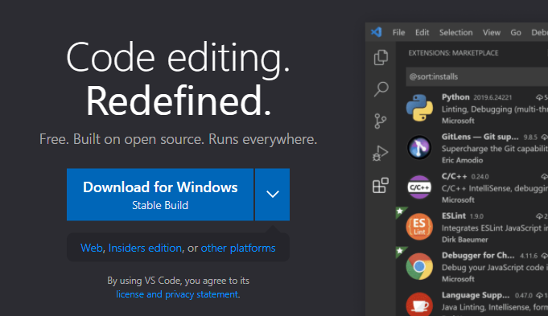

インストーラを起動したら基本的に進めて問題ありませんが、  
途中で出てくるウィザードでは以下の3つにチェックがつけることをおすすめします。
（ファイルやフォルダを右クリックして、vscodeを起動できるようになる。）  
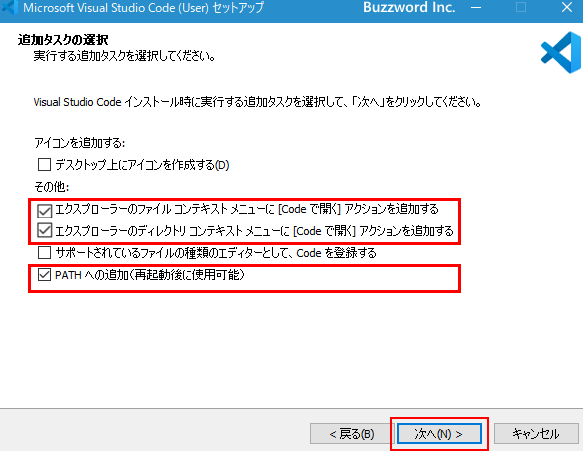

# Pythonの実行
エクスプローラでどこか適当な場所にPythonの作業用フォルダを作成してください。
そのフォルダの中に，test.pyなど拡張子が.pyのファイルを作成してください。

作成したフォルダを右クリックして「Codeで開く」を選択すると、
選択したフォルダをワーキングディレクトリとしてvscodeが起動します。
  
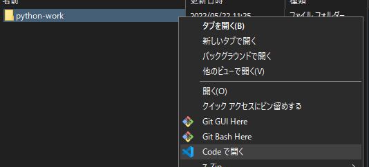
  
左の「エクスプローラー」にフォルダ内にあるファイルが表示されるので，先ほど作成したpythonファイルを選択して編集します。  
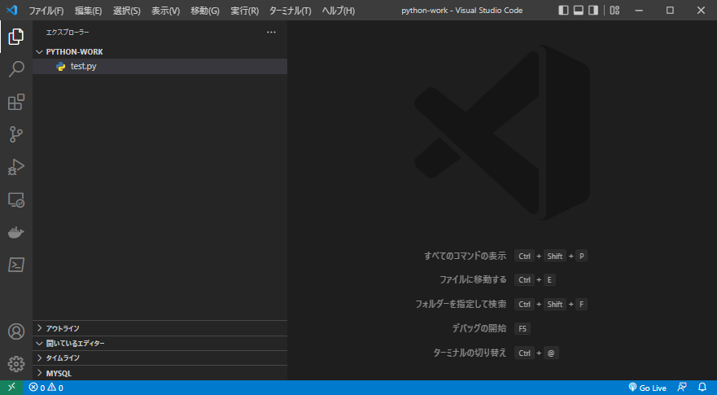  

pythonファイルに以下を書き込み実行してみます。
```python
import datetime

now = datetime.datetime.now() # 現在時刻の取得
today = now.strftime('%Y年%m月%d日') # 現在時刻を年月曜日で表示
print(today)
```

vscodeから実行したい場合は、右上の▷をクリックすることで、
vscode内にPowerShellが表示されて、表示しているpythonファイルが実行されます。  
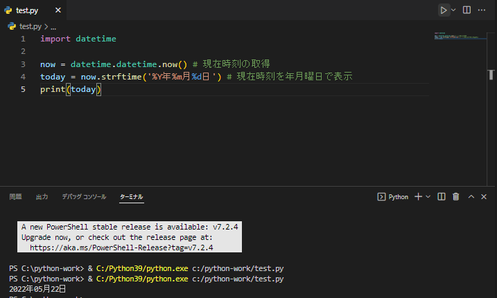  

もちろん、コマンドプロンプトからでも実行できます。
pythonを実行するには「python 【pythonファイル】」で実行できます。  
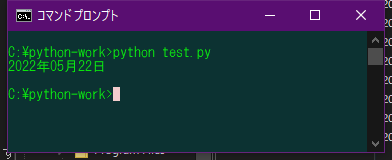  

ipynbはJupyterNotebookで扱うファイル形式ですが、
vscodeを使うとJupyterNotebookをインストールしていなくてもipynbを扱えます。

## ipynbについて
ファイル内に記載されているプログラムがすべて実行されますが、
部分的にコードを実行したい場合も多々あります。

「Pythonの環境構築」で紹介したJupyterNotebookを使えば、
1つのファイルであってもコードを部分的に「コードブロック」と呼ばれる単位での実行が可能になります。
これは、.ipynbという拡張子を用いると使うことができます。  
  

ipynbの中身は以下のようなjson形式で書かれます。  
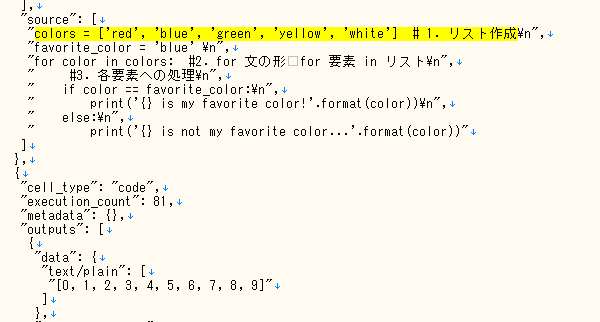  

ipynbはJupyterNotebook専用の形式ですが、
vscodeでも拡張機能をいれることで扱えるようになります。

vscodeの拡張機能は左の□が重なっているマークから「python」と検索して一番上に出てくる  
拡張機能をインストールします。  
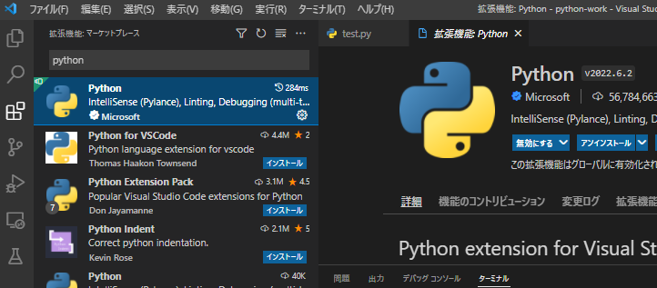  

拡張機能をインストールしたら、
拡張子を「.ipynb」としたファイルを作成して開くと、コードブロック単位での実行が可能になっていることがわかります。  
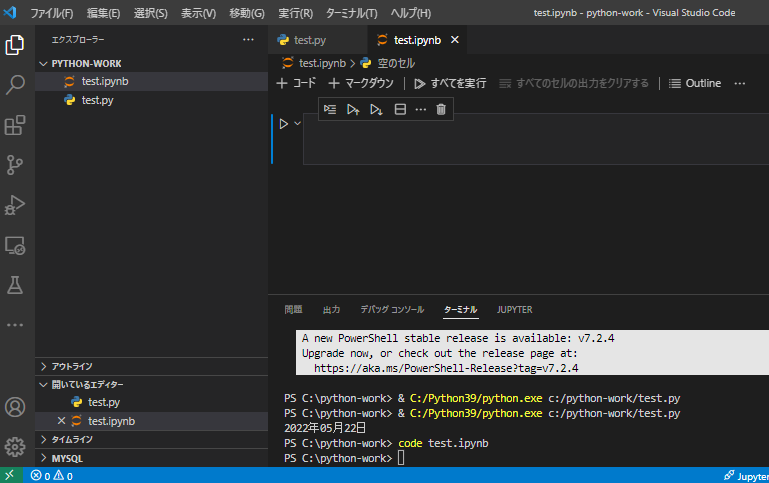img  

コードブロックの実行は「Shift + Enter」です。
以下のように、ブロック単位で実行できます。  
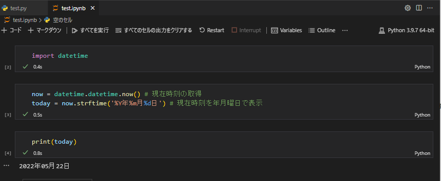  