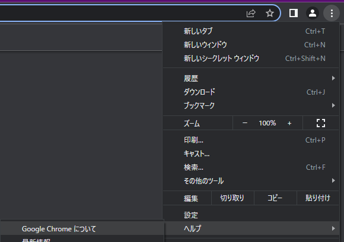
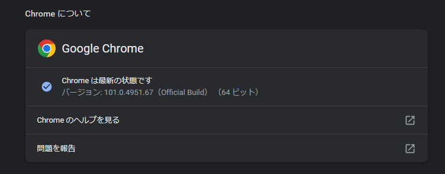
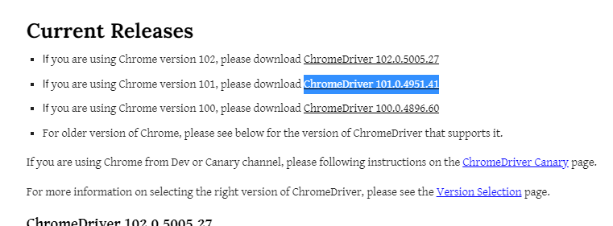
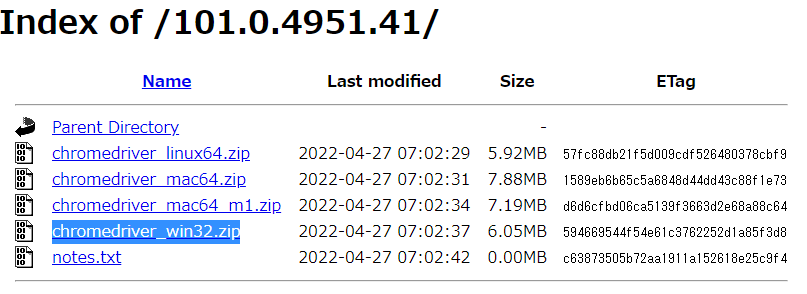
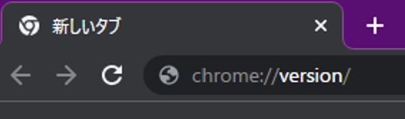
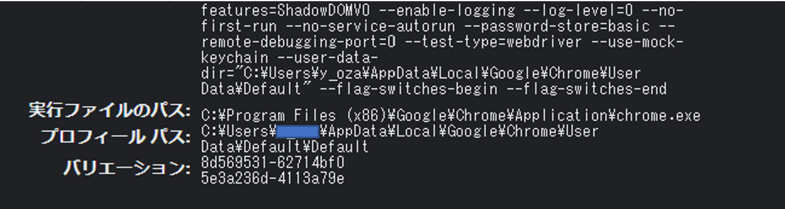

# Selenium
Seleniumはブラウザの自動操作を可能にするライブラリです。
Chromeを操作することが多いので、ここではSeleniumを使うためのChromeの準備について記載します。

## Chromeドライバのインストール
Chromeを開いてメニューのヘルプ -> Google Chromeについてを選択します。
  
「Chromeについて」にバージョンが表示されているので確認します。  
  

以下のサイトを開くと、バージョンごとのダウンロードリンクがあるので、先ほど確認したバージョンのリンクをクリックします。
（下2桁は同じでなくても問題ありません）  
https://chromedriver.chromium.org/downloads  

  

OSごとのリンクがあるので，「win32」のものをクリックしてダウンロードします。  
  

ダウンロードした「chromedriver.exe」をPythonのプログラム内でパスを記載するので、
どこかわかりやすいところに配置しておいてください。
例）C:\python\chromedriver.exe

※Chromeをバージョンアップするとドライバのバージョンも変わるため、  
Chromeのバージョンアップにより正しく動作しなくなった場合には、ドライバの再取得を行ってください。

## プロフィールパスの確認
「ロボットではありません」で画像を選ぶ画面などがあるサイトでは、
そのログイン処理の自動化が難しいので一度自分でログインしておき、ブラウザのログイン情報を保存させてきます。
プログラムの実行時にはそのログイン情報を参照させてログインさせます。

ログイン情報などは「プロフィール パス」に保存されるため、そのパスについて確認しておきます。

Chromeで「chrome://version/」を開き，「プロフィール パス」に記載されているパスを確認してください。  
  

基本的には「C:\Users\【カレントユーザ】\AppData\Local\Google\Chrome\User Data\Default」である想定ですが、もし異なっていた場合はプログラムを修正する必要があるのでパスを控えておいてください。
  
  

## 社内利用の場合
プロキシの入力を求められるため、
**自動化のスクリプトで起動したブラウザに対して**、以下のChromeの拡張機能をいれておきます。  
（自分で開いたブラウザとは異なります。Seleniumのスクリプトを実行して起動したブラウザに設定してください。）
https://chrome.google.com/webstore/detail/proxy-helper/mnloefcpaepkpmhaoipjkpikbnkmbnic/support?hl=ja

拡張機能の設定を行います。  
GeneralのProxy Serversに以下を設定してください。
- HTTPS PROXY: proxy1.〇〇〇〇info.jp
- PORT: 8089
PACのPac URLに以下を設定してください。（〇〇〇〇は会社名に置き換えてください。）
- https://proxy.〇〇〇〇info.jp/pac/proxy.pac
AuthentificationのAuthentificationに以下を設定してください。
- Username: 社員番号
- Password: COMPASSのパスワード

## その他注意点
スクリプトを実行してブラウザが起動している状態で、さらにスクリプトを実行してブラウザを起動させると、あとから実行させたプログラムをうまく動作しません。  
実行の際には、前回実行して起動しているブラウザが残っていないかを確認して、起動していれる場合は閉じてから実行してください。